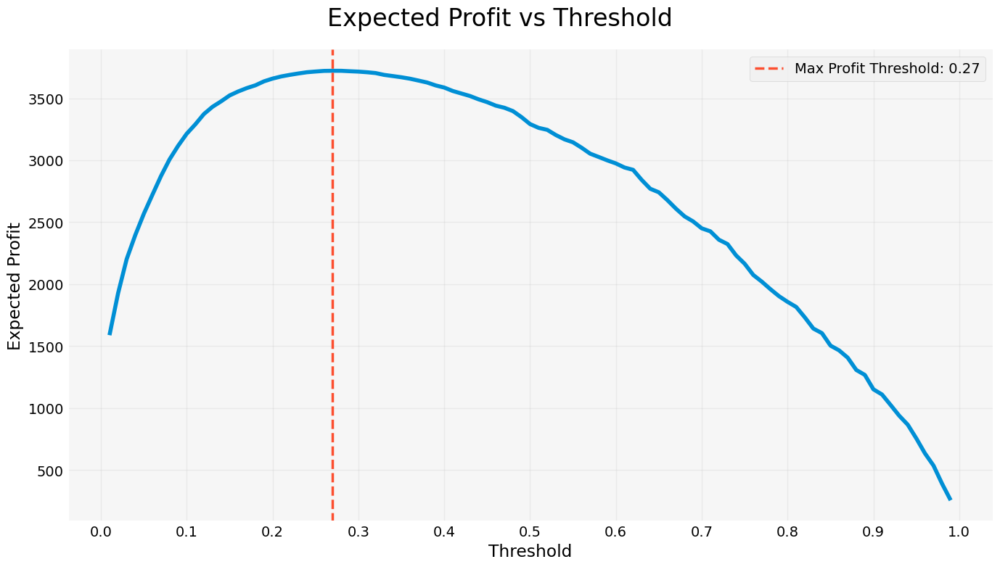
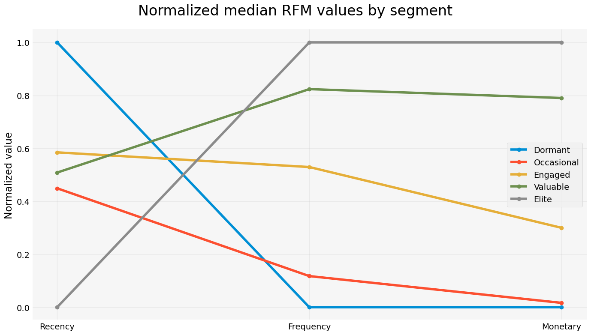
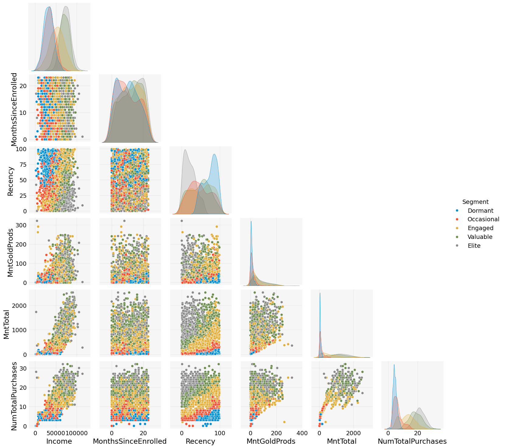
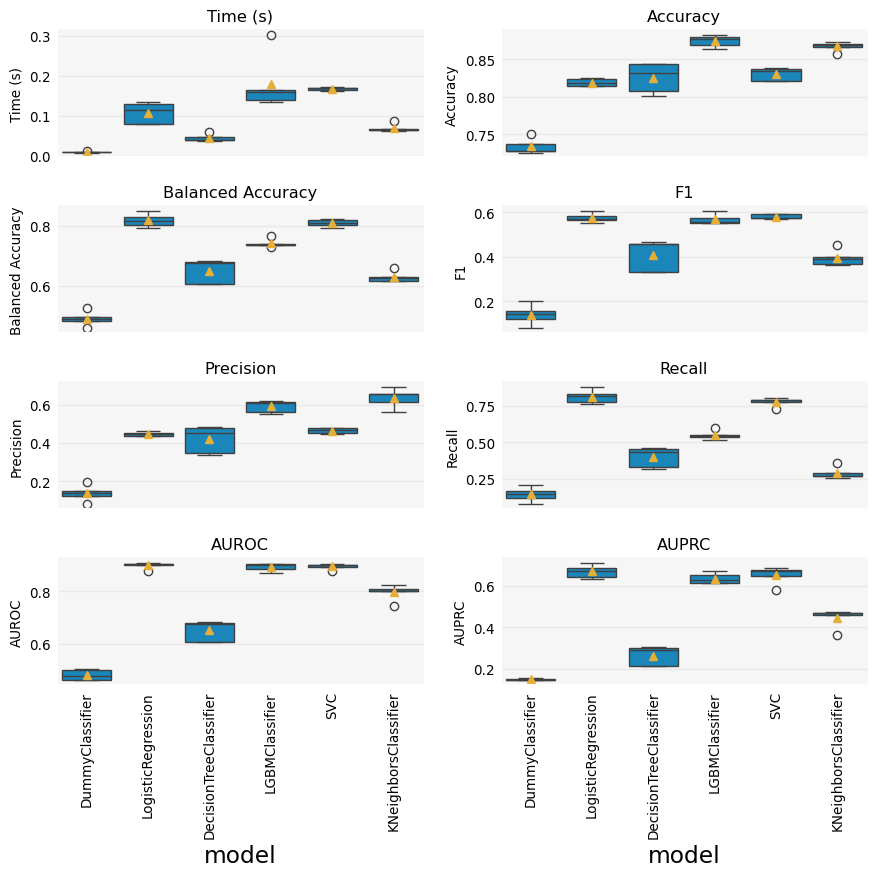
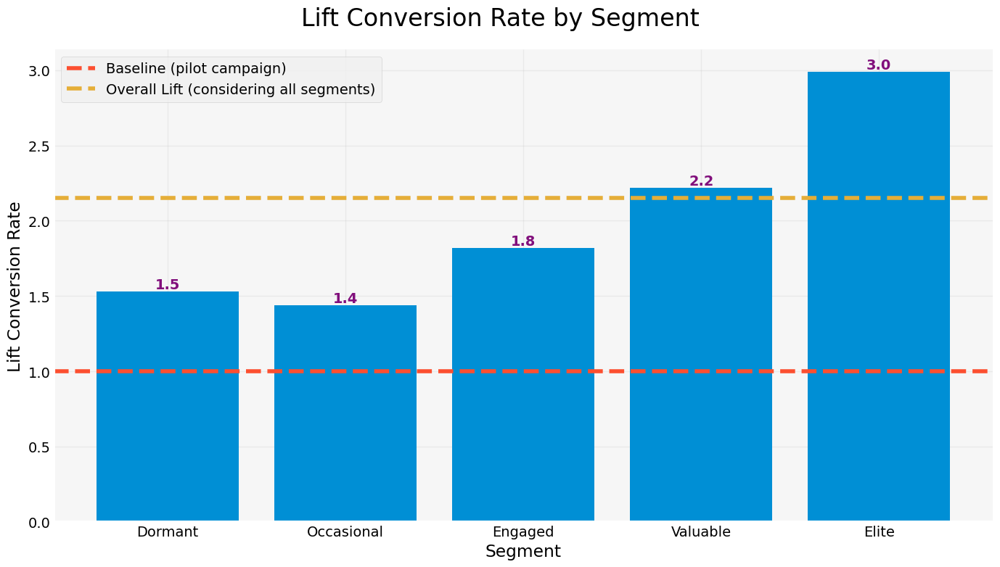

[](https://www.linkedin.com/in/flsbustamante/)
[](https://pyscaffold.org/)
[](https://www.python.org/)

# marketing_case

> Turning data into smarter marketing — prediction of customer behavior to maximize profit

This project focuses on improving the performance of a direct marketing campaign by
leveraging data analysis and predictive modeling. The goal is to identify customers most
likely to respond positively to a marketing offer, maximizing campaign profitability and
optimizing budget allocation.



A company in the retail food sector conducted a pilot marketing campaign targeting 2,240
randomly selected customers with a new product offer. The results showed a low success
rate (15%) and a negative profit. To enhance future campaigns, the company
seeks to develop a predictive model that will:

- Analyze customer characteristics to understand what influences purchasing decisions.
- Segment customers based on their behavior and likelihood to respond.
- Improve targeting efficiency by selecting only high-potential customers, making the next campaign profitable.

This project was inspired by [this
repository](https://github.com/ifood/ifood-data-business-analyst-test). I did not
participate in the selection process described in the linked repository, nor do I have
any association with the company mentioned there. I simply came across the project
online, considered it interesting, and decided to add it to my portfolio.

The full case description can be found in the `references` folder. Or directly in this
[PDF file](references/case_description.pdf).

The data dictionary can be found in the `references` folder. Or directly in this
[Markdown file](references/README.md).

## Main results

The study was divided into five main parts, each one with its own notebook in the
[`notebooks`](notebooks/) folder:

1. **Data cleansing and feature engineering**: The data was cleaned and transformed to
   create new features that could be used in the predictive models. [Notebook 1](notebooks/01-flsb-data_cleansing.ipynb).
2. **Exploratory data analysis**: The data was analyzed to understand the behavior of the
   customers and to identify patterns that could be useful in the predictive models. [Notebook 2](notebooks/02-flsb-eda.ipynb).
3. **Customer segmentation**: The customers were segmented into groups with similar behavior
   to help in the analysis and prediction of customer behavior. [Notebook 3](notebooks/03-flsb-segmentation-rfm.ipynb).
4. **Predictive modeling**: Several models were trained to predict customer behavior and
   the best model was selected to be used in the next campaign. [Notebook 4](notebooks/04-flsb-classification_models.ipynb).
5. **Profit curve**: A profit curve was created to help in the decision-making process of
   the company. [Notebook 5](notebooks/05-flsb-profit_analysis.ipynb).

The segmentation was done using the RFM model, which divides the customers into groups
based on their recency, frequency, and monetary value. Five segments were created,
as shown in the image below.



Each segment has its own characteristics and behavior, that can be shown plotting the
features using the segments as hue.



The predictive modeling was done using several models, that were compared considering
various metrics:



The best model was the Logistic Regression, that was then fine-tuned using GridSearchCV.

The profit curve was created using the best model, and it shows the expected profit
for each threshold of the model. The curve can be used to decide the best threshold
to maximize the profit of the campaign.


With the selected threshold, the lift curve was created to show the improvement in
profit compared to a random selection of customers:




## Installation

In order to set up the necessary environment:

1. review and uncomment what you need in `environment.yml` and create an environment `marketing_case` with the help of [conda]:
   ```
   conda env create -f environment.yml
   ```
2. activate the new environment with:
   ```
   conda activate marketing_case
   ```

3. install the package in editable mode with:
   ```
   pip install -e .
   ```
   This will install the package in editable mode, so you can modify the source code and
   directly import the package in Python.

> **_NOTE:_**  The conda environment will have marketing_case installed in editable mode.
> Some changes, e.g. in `setup.cfg`, might require you to run `pip install -e .` again.


Optional and needed only once after `git clone`:

4. install several [pre-commit] git hooks with:
   ```bash
   pre-commit install
   # You might also want to run `pre-commit autoupdate`
   ```
   and checkout the configuration under `.pre-commit-config.yaml`.
   The `-n, --no-verify` flag of `git commit` can be used to deactivate pre-commit hooks temporarily.

5. install [nbstripout] git hooks to remove the output cells of committed notebooks with:
   ```bash
   nbstripout --install --attributes notebooks/.gitattributes
   ```
   This is useful to avoid large diffs due to plots in your notebooks.
   A simple `nbstripout --uninstall` will revert these changes.

Then take a look into the `scripts` and `notebooks` folders.

### MLFlow setup

The notebooks have all the consolidated results of the models, with the numerical results
and visualizations. If you want even more detailed results, you can use MLFlow to track
the experiments. To set up MLFlow, you need to:

1. Open the `.env` file present in the `src/marketing_case` folder.
2. Set the `MLFLOW_ON` variable to True.
3. Run the code of the classification notebook.
4. A folder called `mlruns` will be created in the `notebooks` folder.
5. To see the results, you need to run the following command in the terminal:
   ```bash
   mlflow ui
   ```


## Dependency Management & Reproducibility

1. Always keep your abstract (unpinned) dependencies updated in `environment.yml` and eventually
   in `setup.cfg` if you want to ship and install your package via `pip` later on.
2. Create concrete dependencies as `environment.lock.yml` for the exact reproduction of your
   environment with:
   ```bash
   conda env export -n marketing_case -f environment.lock.yml
   ```
   For multi-OS development, consider using `--no-builds` during the export.
3. Update your current environment with respect to a new `environment.lock.yml` using:
   ```bash
   conda env update -f environment.lock.yml --prune
   ```
## Project Organization

```
├── AUTHORS.md              <- List of developers and maintainers.
├── CHANGELOG.md            <- Changelog to keep track of new features and fixes.
├── CONTRIBUTING.md         <- Guidelines for contributing to this project.
├── LICENSE.txt             <- License as chosen on the command-line.
├── README.md               <- The top-level README for developers.
├── data
│   ├── external            <- Data from third party sources.
│   ├── interim             <- Intermediate data that has been transformed.
│   ├── processed           <- The final, canonical data sets for modeling.
│   └── raw                 <- The original, immutable data dump.
├── docs                    <- Directory for Sphinx documentation in rst or md.
├── environment.yml         <- The conda environment file for reproducibility.
├── models                  <- Trained and serialized models
├── notebooks               <- Jupyter notebooks. Naming convention is a number (for
│                              ordering), the creator's initials and a description,
│                              e.g. `1.0-fw-initial-data-exploration`.
├── pyproject.toml          <- Build configuration. Don't change! Use `pip install -e .`
│                              to install for development or to build `tox -e build`.
├── references              <- Data dictionaries, manuals, and all other materials.
├── reports                 <- Generated analysis as HTML, PDF, LaTeX, etc.
│   └── figures             <- Generated plots and figures for reports.
├── setup.cfg               <- Declarative configuration of your project.
├── setup.py                <- [DEPRECATED] Use `python setup.py develop` to install for
│                              development or `python setup.py bdist_wheel` to build.
├── src
│   └── marketing_case      <- Actual Python package where the main functionality goes.
├── tests                   <- Unit tests which can be run with `pytest`.
├── .coveragerc             <- Configuration for coverage reports of unit tests.
├── .isort.cfg              <- Configuration for git hook that sorts imports.
└── .pre-commit-config.yaml <- Configuration of pre-commit git hooks.
```

<!-- pyscaffold-notes -->

## Note

This project has been set up using [PyScaffold] 4.6 and the [dsproject extension] 0.7.2.

[conda]: https://docs.conda.io/
[pre-commit]: https://pre-commit.com/
[Jupyter]: https://jupyter.org/
[nbstripout]: https://github.com/kynan/nbstripout
[PyScaffold]: https://pyscaffold.org/
[dsproject extension]: https://github.com/pyscaffold/pyscaffoldext-dsproject
